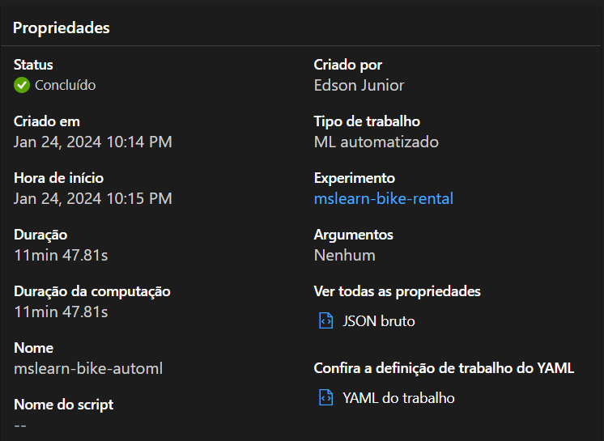
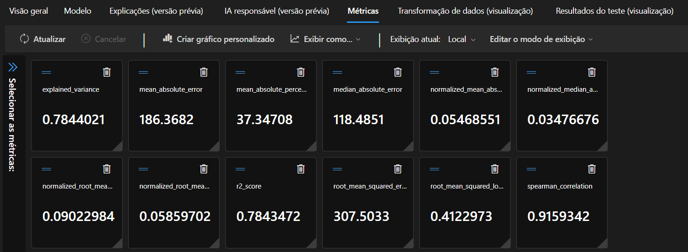
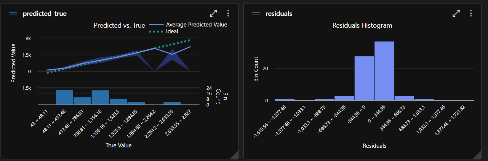

# Automated Machine Learning in Azure Machine Learning

Este repositório foi criado para apresentar minha primeira experiência com a ferramenta de Aprendizado de Máquina da Azure, a qual foi aprendida durante o bootcamp da DIO seguindo o [tutorial](https://microsoftlearning.github.io/mslearn-ai-fundamentals/Instructions/Labs/01-machine-learning.html) do site da Azure Machine Learning para empregar uma das ferramentas de Inteligência Artificial disponibilizadas pela Azure, que é o Aprendizado de Máquina Automatizado. Isso permite explorar diferentes algoritmos e parâmetros para treinar diversos modelos e identificar o mais adequado para os seus dados. O guia envolve a criação de um modelo de regressão para predizer a quantidade de bicicletas alugadas no mês, utilizando um [dataset público](https://aka.ms/bike-rentals).

## Modelos

- LightGBM
- RandomForest

## Resumo do Modelo

## Métricas do Modelo

## Análise do Modelo

## Requisitos

- Criar uma conta grátis no Microsoft Azure
